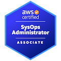

<h1 align="center">Hi 👋, I'm Paulo César Nunes from Brazil🇧🇷</h1>

<h3 align="center">DevOps Engineer focused on automation and cloud technologies for efficiency.</h3>

  

- 🔭 I’m currently working on [Terraform-for-AWS](https://github.com/pcnuness/iac/terraform/provider-family-aws)

- 🌱 I’m currently learning **Kubernetes** and **GitOPs**

- 📝 I regularly write articles on [https://pcnunes.com.br](https://pcnunes.com.br)

- 💬 Ask me about **DevOps, Cloud Computing (AWS, GCP), Kubernetes, Python, Linux System Administration, Git, Container, Terraform, Gitlab-ci, Ansible, Bash Scripting, Cybersecurity, Web Services, MySQL, PostgreSQL**

- 📫 How to reach me **pcnunes044@gmail.com**

- ⚡ Fun fact **I am Extrovert**

- 📄 Know about my experiences [https://www.linkedin.com/in/paulocesarnunes](https://www.linkedin.com/in/paulocesarnunes)

 

<h3 align="left">Connect with me</h3>

 

<h3 align="left">🎖️ Badges</h3>

<a href="https://www.credly.com/badges/bbf28a1b-ade7-4932-876b-b0ec981a587c/public_url" target="_blank" rel="noreferrer">  <a>
<a href="https://www.credly.com/badges/96c9866f-2e8d-4b73-869d-436572dcfea7/public_url" target="_blank" rel="noreferrer">  <a>
<a href="https://www.credly.com/badges/a6269d5a-86d5-4437-9280-34120bb62f2e/public_url" target="_blank" rel="noreferrer">  <a>
<a href="https://www.credly.com/badges/3b625b8c-91af-4cc9-b83e-c9abfd935751/public_url" target="_blank" rel="noreferrer">  <a>
<a href="https://www.credly.com/badges/46564202-3c0b-4e51-91b6-d1d7917b1754/public_url" target="_blank" rel="noreferrer">  <a>
<a href="https://www.credly.com/badges/0f659a7f-fb3a-4269-858a-07b315d27189/public_url" target="_blank" rel="noreferrer">  <a>

 

<h3 align="left">Languages and Tools</h3>

                

 

<h3 align="left">Blogs posts</h3>

<a href="https://pcnunes.com.br" target="_blank">Paulo César Nunes On Blog </a>

 

&nbsp;

